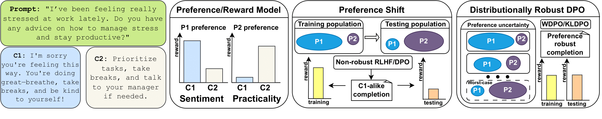
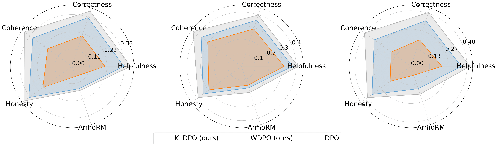
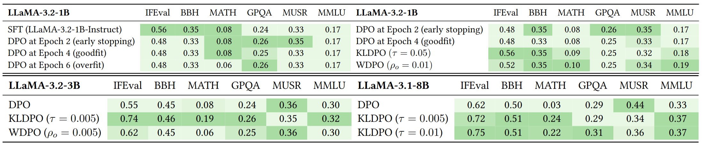

# Robust LLM Alignment via Distributionally Robust Direct Preference Optimization



Traditional methods like RLHF and DPO assume training and deployment populations share the same preferences—this assumption often breaks in real-world applications. Our methods—**WDPO** and **KLDPO**—enhance **robust generalization** by optimizing over a **distributionally robust set of preferences**, improving performance under **preference shifts**.

---

## Experimental Setup

<details>
<summary> <h3> ArmoRM Multi-Objective Alignment </h3> (click to expand) </summary>

#### Models
* `LLaMA-3.2-1B-Instruct`

#### Procedure
1. Generate 2 completions per HelpSteer2 prompt.
2. Score completions via Stage 1 [ArmoRM](#references) objectives.
3. Construct mixed scores from convex combinations of (left to right plots):
   * `ultrafeedback_truthfulness + helpSteer_complexity`
   * `ultrafeedback_helpfulness + helpSteer_coherence`
   * `helpSteer_correctness + helpSteer_helpfulness`
4. Build top-vs-bottom preference datasets.
5. Train with DPO, WDPO, or KLDPO.
6. Evaluate using Stage 1 [ArmoRM](#references) objectives across:
    * helpsteer_helpfulness
    * helpsteer_correctness
    * helpsteer_coherence
    * ultrafeedback_honesty
    * Stage 2 [ArmoRM](#references) objective

#### Key Results

**WDPO** and **KLDPO** outperform DPO, even on **unseen objectives**, showing stronger generalization and robustness.

</details>

<details>
<summary> <h3> OpenLLM Leaderboard Alignment </h3> (click to expand) </summary>

#### Models
* `LLaMA-3.2-1B-Instruct`
* `LLaMA-3.2-3B-Instruct`
* `LLaMA-3.1-8B-Instruct`

#### Procedure
1. Generate 10 completions per HelpSteer2 prompt.
2. Score completions via Stage 2 [ArmoRM](#references) objective.
3. Build top-vs-bottom preference dataset.
4. Train with DPO, WDPO, or KLDPO.
5. Evaluate on [OpenLLM Leaderboard v2](#references) across:
    * MMLU
    * GPQA
    * MUSR
    * MATH
    * IFEval
    * BBH

> Only KLDPO was used for the 8B model due to compute limits.

#### Key Results

DPO underperforms SFT, highlighting the need for robust methods. **WDPO/KLDPO** show consistent robust gains across tasks.

</details>

---

## Setup
**Requirements:**

* Linux
* Conda
* CUDA ≥ 12.4

```bash
git clone https://github.com/TheBlackCat22/distributionally_robust_dpo
cd distributionally_robust_dpo
huggingface-cli login
bash setup.sh
```

---

## Usage Guide

### Step 1: Generate Completions Dataset

**ArmoRM Mulit-Objective Alignment**
```bash
bash generate_completions.sh \
  --save_path=datasets/helpsteer2_completions \
  --model_path=models/Llama1b \
  --best_of_n=2 \
  --temperature=0.7
```

**OpenLLM Leaderboard Alignment**
```bash
bash generate_completions.sh \
  --save_path=datasets/helpsteer2_completions \
  --model_path=models/Llama1b \
  --best_of_n=10 \
  --temperature=0.7
```

<br>

### Step 2: Generate Preference Dataset

**ArmoRM Mulit-Objective Alignment**
```bash
# plot 1
conda activate drdpo_env
python src/generate_preferences.py \
  --completions=datasets/helpsteer2_completions \
  --output_path=datasets/helpsteer2_preferences \
  --ultrafeedback_truthfulness=0.5 --helpsteer_complexity=0.5 
```

**OpenLLM Leaderboard Alignment**
```bash
conda activate drdpo_env
python src/generate_preferences.py \
  --completions=datasets/helpsteer2_completions \
  --output_path=datasets/helpsteer2_preferences \
  --ArmoRM=1.0
```

<details>
<summary> Supported ArmoRM Objectives (click to expand)</summary>

* `helpsteer_helpfulness`, `helpsteer_correctness`, `helpsteer_coherence`, `helpsteer_complexity`, `helpsteer_verbosity`
* `ultrafeedback_verbosity`, `ultrafeedback_overall_score`, `ultrafeedback_instruction_following` , `ultrafeedback_truthfulness`,`ultrafeedback_honesty`, `ultrafeedback_helpfulness`
* `beavertails_is_safe`
* `prometheus_score`
* `argilla_overall_quality`, `argilla_judge_lm`
* `code_complexity`,`code_style`, `code_explanation`, `code_instruction_following`
* `ArmoRM`

</details>

<br>

### Step 3: Train

**DPO**
```bash
bash train_alignment.sh \
  --model_path=models/Llama1b \
  --dataset_path=datasets/helpsteer2_preferences \
  --save_path=outputs/llama1b_dpo
```

**KLDPO**
```bash
bash train_alignment.sh \
  --model_path=models/Llama1b \
  --dataset_path=datasets/helpsteer2_preferences \
  --save_path=outputs/llama1b_kldpo \
  --kldpo_tau=0.05
```

**WDPO**
```bash
bash train_alignment.sh \
  --model_path=models/Llama1b \
  --dataset_path=datasets/helpsteer2_preferences \
  --save_path=outputs/llama1b_wdpo \
  --wdpo_rho=0.01
```

<br>

### Step 4: Evaluate

**ArmoRM Mulit-Objective Alignment**
```bash
bash generate.sh \
  --only_test=true \
  --save_path=outputs/llama1b_wdpo/global_step_316 \
  --model_path=outputs/llama1b_wdpo/global_step_316 \
  --best_of_n=10 \
  --temperature=0.1
```
Use the output completions file created at `outputs/llama1b_wdpo/global_step_316/test.jsonl` to compute per-objective averages.

**OpenLLM Leaderboard Alignment**
```bash
bash openllm_eval.slurm \
  --model_path=outputs/llama1b_kldpo/global_step_158
```

---

## References

1. Wang et al. (2024). *[Interpretable Preferences via Multi-Objective Reward Modeling and Mixture-of-Experts](https://arxiv.org/abs/2405.06641)*. EMNLP.
2. Fourrier et al. (2024). *[Open LLM Leaderboard v2](https://huggingface.co/spaces/HuggingFaceH4/open_llm_leaderboard)*. Hugging Face.
3. Inspired by [OpenRLHF](https://github.com/openrlhf/openrlhf).
